<!-- Rendered by scripts/render.mjs; the numbers refresh daily via GitHub Actions. -->

<picture>
  <source media="(prefers-color-scheme: dark)" srcset="assets/neofetch-dark.svg">
  
</picture>

<pre>
<b>abhishek@github</b>:<b>~</b>$ finger abhishek
Login: abhishek                         Name: Abhishek Kumar
Directory: /home/delhi                  Shell: /bin/zsh
Last login: just now, from a terminal   Mail: <a href="mailto:abhimait1909@gmail.com">abhimait1909@gmail.com</a>
Plan:
  I take products from the first commit to revenue — and keep them standing.
  Founding &amp; infra engineer across full-stack product, infrastructure and AI.
  Previously co-founder &amp; CTO at Creatr AI, engineer on Meshery at Layer5,
  Linux Foundation / CNCF mentee at OpenEBS, Google Summer of Code mentor.
</pre>

<pre>
<b>abhishek@github</b>:<b>~</b>$ ls -la ~/journey --sort=time
total 10
drwxr-xr-x  2025–26  <a href="https://getcyborg.ai/">cyborg-ai/</a>    Founding &amp; Infra Engineer  double digits → $250K ARR, 100% uptime
drwxr-xr-x  2023–24  <a href="https://getcreatr.com/">creatr/</a>       Co-founder &amp; CTO           $1.2M raised · 3 launches · 80k+ users
drwxr-xr-x  2022–23  <a href="https://github.com/meshery/meshery">meshery/</a>      SWE · Layer5               built &amp; shipped MeshMap · Intel tooling
drwxr-xr-x  2021–22  <a href="https://mentorship.lfx.linuxfoundation.org/project/64e3add3-060b-4ffa-9408-1289e2f2fdc5">openebs/</a>      LFX Mentee · CNCF          openebsctl: upgrade jobs, all CAS types
drwxr-xr-x  2021     <a href="https://summerofcode.withgoogle.com/archive/2021/organizations/5722851356704768">gsoc/</a>         GSoC Mentor · JBoss        2 students · education platform + app
drwxr-xr-x  2021     <a href="https://fellowship.mlh.io/">mlh/</a>          MLH Fellow · Explorer      12 weeks, a new product every two
drwxr-xr-x  2020–21  <a href="https://www.youtube.com/c/CodeforCause">codeforcause/</a> SWE &amp; Mentor               500+ students · podcasts with OSS orgs
drwxr-xr-x  2020–21  <a href="https://github.com/checkstyle/checkstyle">checkstyle/</a>   Open-source Developer      rewrote Indentation · used by millions
drwxr-xr-x  2019–20  <a href="https://github.com/Abhishek-kumar09/Segura">segura/</a>       Flutter Developer          client + server for a luggage service
lrwxrwxrwx  2018–22  mait-delhi -&gt; B.Tech, Computer Science · MAIT Delhi
</pre>

<pre>
<b>abhishek@github</b>:<b>~</b>$ cat ~/journey/creatr/investors
<a href="https://www.accel.com/"><picture><source media="(prefers-color-scheme: dark)" srcset="assets/accel-dark.svg"></picture></a>      <a href="https://allincapital.vc/"><picture><source media="(prefers-color-scheme: dark)" srcset="assets/allin-dark.svg"></picture></a>
</pre>

<pre>
<b>abhishek@github</b>:<b>~</b>$ git log --graph --oneline --author=abhishek upstream/
* <a href="https://github.com/meshery/meshery/pulls?q=is%3Apr+author%3AAbhishek-kumar09+is%3Amerged+sort%3Aupdated-desc">meshery/meshery</a>         168 PRs merged · 835 commits · <a href="https://github.com/meshery/meshery/graphs/contributors">#14 of 300+ contributors</a> · 11.5k★
│ ├ MeshMap — design configurator, MeshModel, OPA policy engine, GraphQL subscriptions, RJSF forms
│ └ <a href="https://github.com/pulls?q=is%3Apr+author%3AAbhishek-kumar09+is%3Amerged+org%3Ameshery-extensions">meshery-extensions</a> — 50+ PRs: Cypress e2e suite, MeshMap snapshot service, Traefik Mesh
* <a href="https://github.com/checkstyle/checkstyle/pulls?q=is%3Apr+author%3AAbhishek-kumar09+is%3Amerged+sort%3Aupdated-desc">checkstyle/checkstyle</a>   28 PRs merged · 9k★ · a linter used by millions of developers
│ ├ Indentation re-implemented: <a href="https://github.com/checkstyle/checkstyle/pull/8719">lambdas</a>, <a href="https://github.com/checkstyle/checkstyle/pull/8083">annotation arrays</a>, <a href="https://github.com/checkstyle/checkstyle/pull/8217">non-list block children</a>
│ └ then fixed the fallout downstream: <a href="https://github.com/pgjdbc/pgjdbc/pull/2024">pgjdbc</a> ×2 · <a href="https://github.com/pmd/pmd/pull/2925">PMD</a> · <a href="https://github.com/xwiki/xwiki-commons/pull/117">XWiki</a>
* <a href="https://github.com/openebs-archive/openebsctl/pulls?q=is%3Apr+author%3AAbhishek-kumar09+is%3Amerged+sort%3Aupdated-desc">openebs/openebsctl</a>      11 PRs merged · #3 contributor · Linux Foundation / CNCF
│ └ upgrade jobs for Jiva & CSPC pools, log streams, local-hostpath volumes
* <a href="https://github.com/pulls?q=is%3Apr+author%3AAbhishek-kumar09+is%3Amerged+org%3Acodeforcauseorg">codeforcause</a>            80+ PRs merged · #1 contributor · org site · <a href="https://github.com/codeforcauseorg/edu-server">edu-server</a> · <a href="https://github.com/codeforcauseorg/edu-client">edu-client</a>
│
* <a href="https://github.com/pulls?q=is%3Apr+author%3AAbhishek-kumar09+is%3Amerged">461 merged pull requests</a> · <a href="https://github.com/pulls?q=is%3Apr+reviewed-by%3AAbhishek-kumar09">545 reviewed</a> · 9.6k contributions, and counting
</pre>

<picture>
  <source media="(prefers-color-scheme: dark)" srcset="assets/htop-dark.svg">
  
</picture>

<pre>
<b>abhishek@github</b>:<b>~</b>$ journalctl -b --grep=honours
[  <b>OK</b>  ] Reached target Linux Foundation Scholarship — 1 of 500 selected worldwide.
[  <b>OK</b>  ] Started <a href="https://summerofcode.withgoogle.com/archive/2021/organizations/5722851356704768">Google Summer of Code</a> mentor — JBoss Community, 2021.
[  <b>OK</b>  ] Started <a href="https://fellowship.mlh.io/">Major League Hacking Fellowship</a> — Explorer track, 2021.
[  <b>OK</b>  ] Started <a href="https://mentorship.lfx.linuxfoundation.org/project/64e3add3-060b-4ffa-9408-1289e2f2fdc5">LFX Mentorship</a> — OpenEBS · CNCF, 2021–22.
[  <b>OK</b>  ] Finished Devpost &amp; MLH hackathons — winner.
[  <b>OK</b>  ] Activated Google Cloud Badge Practitioner.
[  <b>OK</b>  ] Delivered 10+ technical workshops across colleges in India.
[  <b>OK</b>  ] Listening on <a href="https://www.producthunt.com/products/bloq-by-creatr">Product Hunt</a> — Bloq by Creatr, 2024.
</pre>

<pre>
<b>abhishek@github</b>:<b>~</b>$ cat ~/.netrc
machine linkedin.com        login <a href="https://www.linkedin.com/in/abhishek-kr09/">abhishek-kr09</a>           
machine x.com               login <a href="https://twitter.com/Abhi_dev_dude">Abhi_dev_dude</a>           
machine producthunt.com     login <a href="https://www.producthunt.com/@abhishek1909">abhishek1909</a>            # 3 launches
machine stackoverflow.com   login <a href="https://stackoverflow.com/users/11966205/aks">aks</a>                     # users/11966205
machine youtube.com         login <a href="https://www.youtube.com/c/CodeforCause">CodeforCause</a>            # live podcasts with open-source orgs
machine mail                login <a href="mailto:abhimait1909@gmail.com">abhimait1909@gmail.com</a>  # the fastest route
</pre>

<pre>
<b>abhishek@github</b>:<b>~</b>$ exit
logout
Connection to github.com closed.
</pre>
